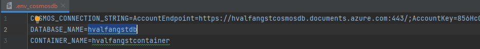
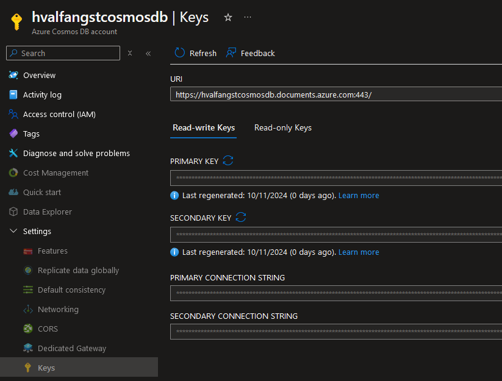

# Python API with Azure Cosmos DB

## Requirements

- **Platform**: x86-64, Linux/WSL
- **Programming Language**: [Python 3](https://www.python.org/downloads/)
- **Terraform**: For provisioning [Azure resources](infra/terraform.tf)
- **Azure Account**: Access to [Azure Subscription](https://azure.microsoft.com/en-us/pricing/purchase-options/azure-account)

## Allocate resources

The script [up](up.sh) provisions Azure resources by applying our [Terraform script](infra/terraform.tf).

## Configure Cosmos DB

### Env file

After resources have been provisioned, one has to create a file named **.env_cosmosdb** in the
root of this project which contains necessary information in order to access our newly provisioned Cosmos DB account such as
connection string, database and container name. These fields will be mapped to our [cosmos config](app/config/cosmos.py).




### Connection string

The connection string may be retrieved from Azure at Settings->Keys for your Cosmos DB account.




## Running API
```bash
python -m uvicorn app.main:app --reload
```


## Deallocate resources

The script [down](down.sh) removes provisioned Azure resources running **terraform destroy**.

## Postman collection
A collection of sample request has been included under the [postman](postman) directory.